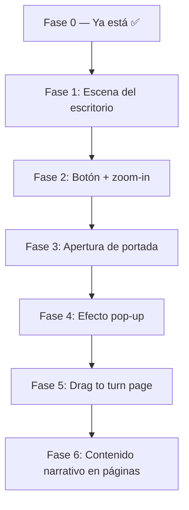

# Análisis: ¿Puede "Amantes de Sumpa" replicar la experiencia Kokuyo?

## Veredicto: ✅ SÍ ES POSIBLE — y el proyecto ya lleva la mitad del camino

---

## 1. Lo que ya tienes construido (y que Kokuyo también usa)

| Técnica Kokuyo | Estado en tu proyecto |
|---|---|
| **Cámara ortográfica** (`OrthographicCamera`) | ✅ `OrthoCamera.jsx` — implementado y funcionando |
| **`MeshBasicMaterial`** (sin sombras, aspecto plano) | ✅ `FlatIllustration.jsx` — ya lo usas en cada plano |
| **GSAP + ScrollTrigger** como motor de animación | ✅ `ScrollNarrativeSetup.jsx` — timeline completa |
| **Objeto dummy target** (desacoplar GSAP de React) | ✅ `gsapTarget.js` — patrón exactamente igual al de Kokuyo |
| **Capas de diorama en eje Z** (parallax 2.5D) | ✅ `LAYER_Z` en `DioramaScene.jsx` — 7 capas definidas |
| **React Three Fiber + Drei** | ✅ en `package.json` |
| **Zustand** para estado narrativo | ✅ `useMuseoStore.js` |
| **Snap de scroll** entre escenas | ✅ en `ScrollTrigger.create()` |

**Conclusión**: tu arquitectura es fundamentalmente la misma que Kokuyo. No es necesario refactorizar nada. Solo hay que **agregar** las capas de animación faltantes.

---

## 2. Lo que Kokuyo tiene y tu proyecto aún no (las brechas)

### 🔴 Brecha 1: La animación de apertura del libro (portada que gira)
**Qué es:** Un `PlaneGeometry` cuyo **pivote de rotación está en el borde izquierdo**, no en el centro. Al girar en el eje Y, simula una página de libro abriéndose.

**Por qué falta:** Actualmente tus planos siempre rotan sobre su propio centro. Para cambiar el pivote hay que usar un `<group>` padre desplazado.

**Cómo implementarlo:**
```jsx
// Truco del pivote en el borde
<group position={[xOffset, 0, 0]}>         {/* Pivote en el lomo */}
  <mesh position={[pageWidth/2, 0, 0]}>    {/* Plano desplazado a la derecha */}
    <planeGeometry args={[pageWidth, pageHeight]} />
    <meshBasicMaterial map={coverTexture} />
  </mesh>
</group>
// Luego: gsap.to(groupRef.current.rotation, { y: -Math.PI, duration: 1.2 })
```

---

### 🔴 Brecha 2: Efecto pop-up (elementos que "emergen" de la página)
**Qué es:** Elementos (mariposas, mano) que comienzan acostados (`rotation.x = Math.PI/2`) en el plano de la página, y cuando la portada llega a cierto ángulo de apertura, se "levantan" interpolando a `rotation.x = 0`.

**Por qué falta:** Tu sistema actual solo anima `position` y `scale` (ver Fases 2-4 en `ScrollNarrativeSetup.jsx`). No hay animación de `rotation.x` para elementos individuales.

**Cómo implementarlo:**
```js
// En gsapTarget.js — agregar:
book: {
  coverRotationY: 0,        // 0 = cerrado, -Math.PI = abierto
  popupRotationX: Math.PI/2, // PI/2 = acostado, 0 = levantado
  butterflyOpacity: 0,
}

// En ScrollNarrativeSetup.jsx — nueva fase:
tl.to(gsapTarget.book, { coverRotationY: -Math.PI, duration: 1.5, ease: 'power2.inOut' })
tl.to(gsapTarget.book, { popupRotationX: 0, duration: 1, ease: 'back.out(1.7)' }, ">-0.5")
```

---

### 🔴 Brecha 3: Zoom-in inicial hacia el libro (transición de escritorio → libro abierto)
**Qué es:** La cámara hace un zoom-in + paneo desde la vista general del escritorio hacia el libro específico.

**Por qué falta:** Tu cámara ya tiene soporte de `zoom` en `gsapTarget.camera.zoom`, pero actualmente comienza en `zoom: 1`. Solo hay que añadir la secuencia de inicio.

**Cómo implementarlo:**
```js
// Ya tienes la infraestructura. Solo añadir al inicio del timeline:
tl.fromTo(gsapTarget.camera, 
  { zoom: 0.6, x: 1.5 },   // Vista alejada del escritorio
  { zoom: 1.0, x: 0, duration: 1.5, ease: 'power2.inOut' }
)
```

---

### 🟡 Brecha 4: Botón de inicio ("Open the notebook")
**Qué es:** Un botón HTML que al clickear dispara la animación de apertura (en lugar de requerir scroll inmediato).

**Por qué falta:** Tu sistema actual comienza directamente con scroll. Kokuyo tiene una pantalla de bienvenida con un botón `play`.

**Cómo implementarlo:** Usar el componente `<Html>` de Drei (que ya usas para el diálogo de Rei) o simplemente un `div` absoluto en el HUD.

---

### 🟡 Brecha 5: Arrastre de página (`Drag to turn the page`)
**Qué es:** Las páginas se pueden girar arrastrando con el mouse/touch, generando un ángulo de rotación proporcional al drag.

**Por qué falta:** Tu sistema es 100% scroll-based. El drag requiere `PointerEvents` + `useGesture` (de `@use-gesture/react`).

**Dependencia adicional necesaria:**
```bash
npm install @use-gesture/react
```

---

## 3. Mapa de implementación propuesto



| Fase | Archivo principal a modificar | Complejidad |
|---|---|---|
| 1. Escena del escritorio (fondo con objetos) | `DioramaScene.jsx` — nueva `EscenaLibro` | 🟢 Baja |
| 2. Botón de inicio + zoom-in de cámara | `HUD.jsx` + `gsapTarget.js` + `ScrollNarrativeSetup.jsx` | 🟢 Baja |
| 3. Portada giratoria (pivote en borde) | Nuevo componente `BookCover.jsx` | 🟡 Media |
| 4. Efecto pop-up de elementos | `gsapTarget.js` + nuevo `PopupElement.jsx` | 🟡 Media |
| 5. Drag to turn page | `@use-gesture/react` + `BookPage.jsx` | 🔴 Alta |
| 6. Texto narrativo en páginas | `Html` de Drei (ya lo usas con los diálogos) | 🟢 Baja |

---

## 4. Ventajas que tienes sobre Kokuyo

Tu proyecto tiene algunas cosas que **Kokuyo no tiene**:

- **Sistema de Escenas** (`ESCENAS[]` + `CAMERA_KEYFRAMES`): Puedes tener un libro con **múltiples capítulos** (uno por cultura precolombina), cada uno con su propia escena pop-up. Kokuyo solo tiene 1 libro.
- **Snap automático** entre secciones: tus snap points ya están definidos y funcionando.
- **HUD narrativo** (`HUD.jsx`): Ya tienes la UI de era/progreso que Kokuyo no tiene.
- **`frameloop="demand"`**: Más eficiente que el enfoque de Kokuyo (que probablemente renderiza 60fps constante).

---

## 5. Dependencias actuales vs. lo que necesitarías agregar

```json
// Ya tienes todo esto ✅
"three": "^0.184.0",
"@react-three/fiber": "^9.6.1",
"@react-three/drei": "^10.7.7",
"gsap": "^3.15.0",
"zustand": "^5.0.14"

// Solo necesitarías agregar esto para drag:
"@use-gesture/react": "^10.x"   // Solo para Fase 5 (drag de páginas)
```

---

## 6. El componente central que falta: `BookCover.jsx`

Este sería el nuevo componente clave para replicar la experiencia Kokuyo:

```jsx
// src/components/BookCover.jsx — Estructura conceptual
function BookCover({ xOffset }) {
  const coverRef = useRef()
  const popupRef = useRef()

  useFrame(() => {
    // Leer del gsapTarget
    if (coverRef.current) {
      coverRef.current.rotation.y = gsapTarget.book.coverRotationY
    }
    if (popupRef.current) {
      popupRef.current.rotation.x = gsapTarget.book.popupRotationX
    }
  })

  return (
    <group position={[xOffset, 0, 0]}>
      
      {/* FONDO: La página interna (siempre visible, debajo) */}
      <FlatIllustration url="/assets/libro-pagina-interior.png" ... />

      {/* PORTADA: Plano con pivote en el borde izquierdo */}
      <group ref={coverRef} position={[-pageWidth/2, 0, 0.1]}>
        <mesh position={[pageWidth/2, 0, 0]}>
          <planeGeometry args={[pageWidth, pageHeight]} />
          <meshBasicMaterial map={coverTexture} side={THREE.DoubleSide} />
        </mesh>
      </group>

      {/* POP-UP: Elementos que emergen de la página */}
      <group ref={popupRef} position={[0, 0, 0.2]}>
        <FlatIllustration url="/assets/mariposas.png" ... />
        <FlatIllustration url="/assets/personaje-popup.png" ... />
      </group>

    </group>
  )
}
```

---

## Conclusión Final

**El proyecto "Amantes de Sumpa" ya tiene el 65-70% de la infraestructura técnica necesaria** para replicar la experiencia Kokuyo. El stack (Three.js, R3F, GSAP, cámara ortográfica, materiales planos, sistema de scroll) es idéntico al inferido del sitio de Kokuyo.

Las brechas son **aditivas** (añadir componentes nuevos), no **disruptivas** (no hay que romper lo que ya funciona). La única dependencia externa nueva sería `@use-gesture/react` para el drag de páginas, y solo si se quiere esa funcionalidad específica.

> **¿Quieres que empecemos por alguna de las fases?** Recomiendo comenzar por la **Fase 3 (BookCover.jsx)** ya que es el corazón visual de la experiencia y todo lo demás gira alrededor de ella.
